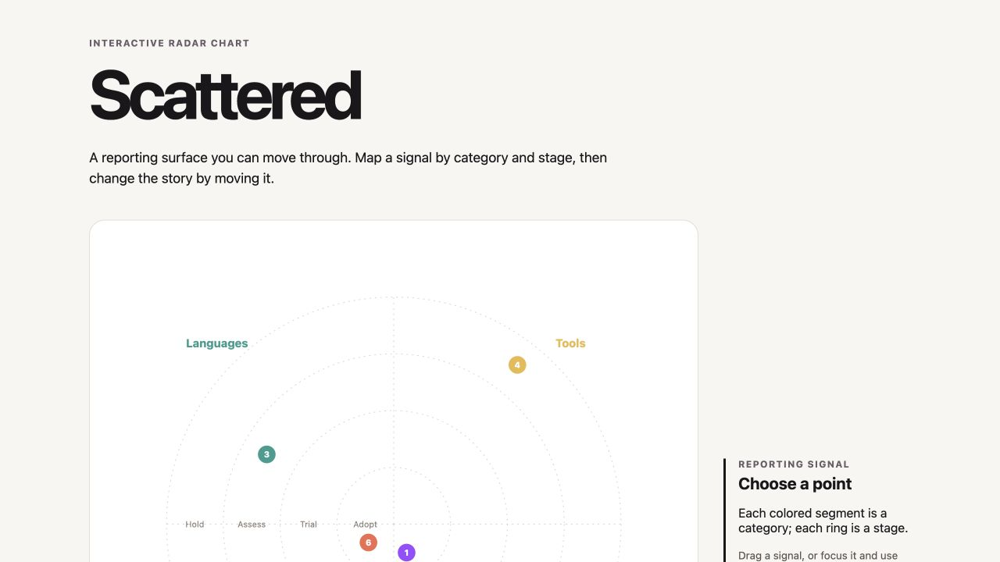
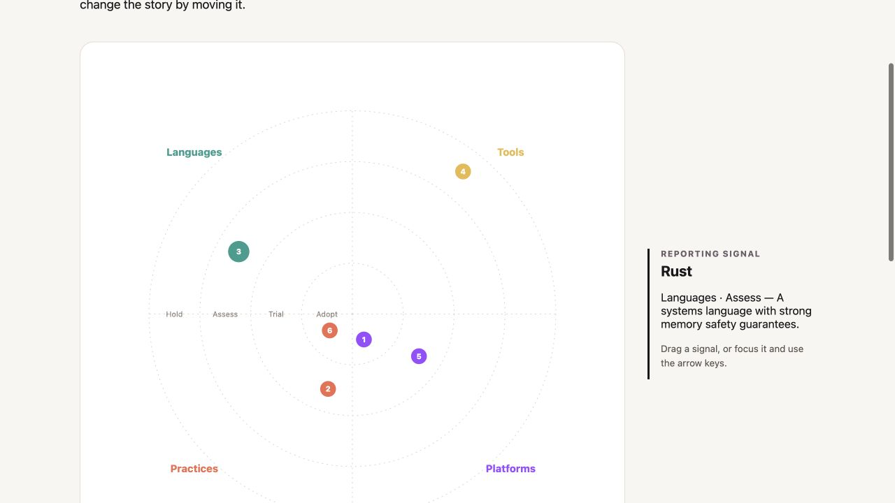
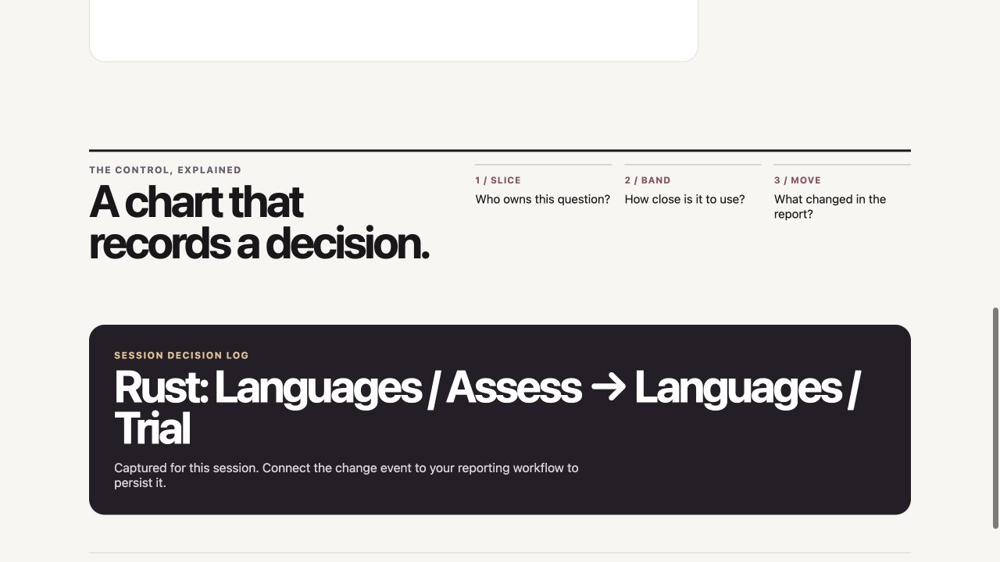

# Scattered

**Scattered** is the 2026 rewrite of Aubrey Alexander's original interactive scattergraph: a dependency-free radial classification control for reporting systems. It keeps the original idea intact—categories as slices, stages as bands, and direct manipulation as the reporting decision—while replacing the 2018 D3/Webpack server stack with small native modules.

## What it does

- Renders a radial scattergraph with named slices and bands.
- Shows a point's category, stage, and optional description when selected.
- Lets people drag a point to reclassify it.
- Supports keyboard reclassification: Left/Right moves slices; Up/Down moves bands.
- Emits a complete, serializable change event for the host application to save.
- Loads either the 2026 data model or the original 2018 `{ radar, bands }` JSON shape.

## See it working

Scattered is deliberately a working reporting surface, not a decorative chart. The screenshots below come from the live demo and show the complete interaction loop.

| Map the portfolio | Inspect a signal |
| --- | --- |
|  |  |
| Categories are radial slices; stages are concentric bands. | Click, hover, or focus a point to reveal its current classification and description. |

| Record the decision |
| --- |
|  |
| Drag a point—or move it with the arrow keys—and consume the emitted `change` event in your application. The demo keeps the update only for the browser session. |

The public demo is at [ui.aubreyalexander.com/scattered](https://ui.aubreyalexander.com/scattered/).

## Feature guide

| Feature | How it works | Why it matters |
| --- | --- | --- |
| **Slices and bands** | Give each item a `slice` and `band`; Scattered calculates its polar position. | Makes a two-axis reporting classification legible at a glance. |
| **Stable layout** | Add optional `position.angle` and `position.radius`; otherwise placement is stable from the item id. | A report does not reshuffle each time it renders. |
| **Direct manipulation** | Drag a point into another slice or band. | The reporting change happens where the decision is understood. |
| **Keyboard movement** | Focus a point: Left/Right changes slice; Up/Down changes band; Enter/Space selects; Escape clears selection. | The core interaction remains available without a pointer. |
| **Search/filtering** | Set the component's `filter` property. | Hosts can narrow a busy radar without duplicating geometry logic. |
| **Read-only reporting** | Add the `readonly` attribute or set `.readonly = true`. | The same control can be used for dashboards and editable review sessions. |
| **Host-owned persistence** | Listen for bubbling `change` events. | Scattered stays portable and never assumes a database, auth model, or save endpoint. |
| **Legacy migration** | Pass the original `{ radar, bands }` JSON. | Existing Scattered reports can move forward without a data conversion project. |

## Run the demo

```sh
npm start
```

Open `http://localhost:8080`. Run `npm test` for the data-model suite.

## Use it in a project

```js
import { defineScatteredRadar } from 'scattered';

defineScatteredRadar();
const radar = document.querySelector('scattered-radar');
radar.data = myRadar;
radar.addEventListener('change', ({ detail }) => save(detail.data));
```

Or load a JSON document declaratively:

```html
<script type="module" src="https://unpkg.com/scattered"></script>
<scattered-radar data-src="/architecture-radar.json" readonly></scattered-radar>
```

## 2026 data model

```json
{
  "title": "Architecture radar",
  "bands": [{ "id": "adopt", "name": "Adopt" }],
  "slices": [{ "id": "tools", "name": "Tools", "color": "#2a9d8f" }],
  "items": [{
    "id": "example",
    "name": "Example",
    "slice": "tools",
    "band": "adopt",
    "position": { "angle": 0.42, "radius": 0.58 }
  }]
}
```

`position` is optional. It records an item’s in-cell placement and prevents a deliberate layout from changing between renders. Omit it to use Scattered’s stable automatic placement.

## Events and accessibility

`select`, `change`, `load`, and `error` bubble and cross the shadow boundary. A `change` event contains the complete updated radar, the changed item, and its complete prior value.

Focus a point, then use arrow keys to move it. Enter or Space selects it; Escape clears selection. Add `readonly` for a non-editable reporting view.

## Original-data compatibility

The component also accepts the original document shape:

```json
{ "radar": [{ "name": "Tools", "points": [{ "name": "Example", "band": "ADOPT" }] }], "bands": { "ADOPT": { "value": 1, "name": "Adopt" } } }
```

Scattered normalizes that document on load, preserving its slices, bands, and points. New work should use the 2026 data model.

## License

[ISC](LICENSE) © Aubrey Alexander
